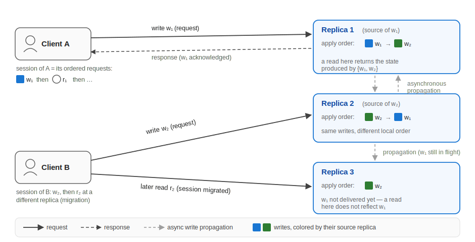

# Consistency Models: Formal Definitions

XDN lets a developer pick the consistency model a replicated service provides.
This page defines precisely what each model means, so that "causal" or "PRAM"
on this site always refers to one exact guarantee. The same names are used with
subtly different meanings across the literature; where definitions differ, we
state the one XDN enforces and quote the original formulation for comparison.

!!! note "Naming"
    The literature also calls these *consistency properties*, *consistency
    semantics*, or *consistency levels*. This site uses **consistency model**.

## The setup

A replicated service consists of a few kinds of components. The figure shows
them all in one deployment:

**Replicas.** A set of servers \(r_1, r_2, \ldots, r_n\), each holding a full
copy of the service state.

**Clients and requests.** Clients issue *requests*: **writes** mutate service
state and **reads** observe it. A request is *invoked* by the client and
completes when its *response* returns.

**Sessions.** The ordered sequence of requests issued by one client is its
*session*. A session is *sticky* while all its requests go to one replica; it
*migrates* when a later request is served by a different replica (Client B in
the figure).

**Sources and source order.** Each write is first executed at exactly one
replica, called that write's *source* (in the figure, replica 1 is the source
of \(w_1\)). The order in which a source executes its own writes is its
*source order*.

**Apply order.** Writes propagate between replicas asynchronously. Each
replica \(r\) applies writes, its own and those it receives, in a local total
order: its *apply order*. A replica applies a write by re-executing it or by
applying its statediff. Different replicas may apply the same writes in
different orders (replicas 1 and 2 in the figure), and a replica may not yet
have received some writes at all (replica 3).

**Reads.** A read served by replica \(r\) returns the state produced by the
set of writes \(r\) has applied so far, its *applied set*.

**Real-time order.** Operation \(o_1\) precedes \(o_2\) *in real time* if
\(o_1\)'s response returned before \(o_2\) was invoked.

!!! info "Two families of models, plus convergence"
    **Server-centric** models (also called *data-centric*) constrain replicas'
    apply orders. Their classic definitions speak of "processes" or
    "processors," which map to replicas here; they have no notion of a client.
    **Client-centric** models constrain what one client session observes as it
    possibly moves across replicas. **Convergence**, whether replicas that
    stop receiving writes reach the same state, is a separate liveness
    concern, and is part of the definition only for eventual consistency.
    This taxonomy follows Tanenbaum & van Steen and Viotti & Vukolić.

The models below are ordered strongest to weakest, with the client-centric
session guarantees last.

---

## Linearizability

**Definition (as enforced by XDN).** An execution is *linearizable* iff there
is a single total order \(T\) over all writes such that:

1. \(T\) is consistent with every source order;
2. \(T\) is consistent with real time: if \(w\) was acknowledged before
   \(w'\) was invoked, then \(w\) precedes \(w'\) in \(T\);
3. every replica's apply order is consistent with \(T\); and
4. every read reflects at least all writes acknowledged before the read was
   invoked.

??? quote "Original definition — Herlihy & Wing, 1990"
    "Linearizability provides the illusion that each operation applied by
    concurrent processes takes effect instantaneously at some point between
    its invocation and its response, implying that the meaning of a concurrent
    object's operations can be given by pre- and post-conditions."

    Formally: "A history H is linearizable if it can be extended (by appending
    zero or more response events) to some history H′ such that: **L1:**
    complete(H′) is equivalent to some legal sequential history S, and
    **L2:** <\_H ⊆ <\_S." Here <\_H "captures the 'real-time' precedence
    ordering of operations in H."

    — M. Herlihy and J. Wing. *Linearizability: A Correctness Condition for
    Concurrent Objects.* ACM TOPLAS 12(3), 1990.

## Sequential consistency

**Definition (as enforced by XDN).** An execution is *sequentially
consistent* iff there is a single total order \(T\) over all writes,
consistent with every source order, such that every replica's apply order is
consistent with \(T\).

This is exactly linearizability **without the real-time clauses**: all
replicas agree on one write order, but a read may observe a stale prefix of
it. What a *client* observes when its session migrates across replicas is a
client-centric question; see the session guarantees below.

??? quote "Original definition — Lamport, 1979"
    A multiprocessor is sequentially consistent if "the result of any
    execution is the same as if the operations of all the processors were
    executed in some sequential order, and the operations of each individual
    processor appear in this sequence in the order specified by its program."

    — L. Lamport. *How to Make a Multiprocessor Computer That Correctly
    Executes Multiprocess Programs.* IEEE Trans. Computers C-28(9), 1979.

## Causal consistency

**Definition (as enforced by XDN).** Let *happens-before* (\(\rightarrow\))
be the smallest transitive relation such that:

1. \(w \rightarrow w'\) if both writes have the same source and \(w\)
   precedes \(w'\) in source order; and
2. \(w \rightarrow w'\) if the source of \(w'\) had applied \(w\) before it
   executed \(w'\).

An execution is *causal* iff every replica's apply order is consistent with
\(\rightarrow\). Writes unordered by \(\rightarrow\) (*concurrent* writes)
may be applied in different orders at different replicas.

Clause 2 is the *potential causality* reading: since a service may read any
part of its state while executing a request, every write the executing
replica had already applied is conservatively treated as a potential cause.
Enforcing this larger relation also enforces causality in the original
read-based sense.

??? quote "Original definition — Ahamad et al., 1995 (and common phrasings)"
    The original formal definition is due to Ahamad, Neiger, Burns, Kohli,
    and Hutto, *Causal memory: definitions, implementation, and programming*,
    Distributed Computing 9(1), 1995. It defines a *writes-into* order (a
    write writes-into the reads that return its value), a *causality order*
    (the transitive closure of per-process program order and writes-into),
    and requires for each process a serialization of its operations plus all
    writes that respects the causality order.

    A common summary (Jepsen): "Causally-related operations should appear in
    the same order on all processes—though processes may disagree about the
    order of causally independent operations."

    On the potential-causality reading (Bailis et al., *Bolt-on Causal
    Consistency*, SIGMOD 2013): "Under potential causality, all writes that
    could have influenced a write must be visible before the write is made
    visible."

## PRAM (FIFO) consistency

**Definition (as enforced by XDN).** An execution is *PRAM-consistent* iff
every replica applies the writes of each single source in that source's
order. Writes of different sources may be applied in different relative
orders at different replicas.

??? quote "Original definition — Lipton & Sandberg, 1988"
    The original technical report defines PRAM operationally (TR p.4, §3):

    "Let P₁, P₂, ..., P_k be processors that share a memory with locations
    0,1,...,m−1. Assume that each processor has a local memory M_i ... The
    memory M_i is the i-th processor's view of the current state of the
    shared memory. Each processor executes read and write commands:
    (1) read(i). Processor P_j executes this operation by performing a normal
    read from location i from its own local memory M_j.
    (2) write(i,v). Processor P_j executes this operation by performing a
    local action and initializing a global action. Locally, it does a normal
    write to its memory M_j at location i with value v. Globally, it sends a
    message ⟨i,v⟩ to all the other processors. No acknowledgement of
    successful message transmission is expected nor is one ever received.
    As these messages ⟨i,v⟩ arrive at a processor they are automatically
    executed."

    — R. Lipton and J. Sandberg. *PRAM: A Scalable Shared Memory.* Princeton
    TR CS-TR-180-88, 1988.

    Note: the widely quoted abstract form, "writes done by a single process
    are seen by all other processes in the order in which they were issued,"
    is the literature's later formulation (e.g., Mosberger 1993); the
    original defines PRAM by the pipelined mechanism above. Jepsen's
    phrasing: "Any pair of writes executed by a single process are observed
    (everywhere) in the order the process executed them; however, writes from
    different processes may be observed in different orders."

## Eventual consistency

**Definition (as enforced by XDN).** An execution is *eventually consistent*
iff, once no new write is executed at any replica, every replica eventually
applies the same set of writes, and replicas that have applied the same set
of writes are in the same state.

The second half is *convergent conflict handling*: concurrent writes must be
resolved identically everywhere. Eventual consistency constrains no read in
the meantime, and it is the only model on this page that *requires*
propagation and convergence.

??? quote "Original definitions — Vogels 2009; Bailis & Ghodsi 2013; COPS 2011"
    Vogels: "Eventual consistency. This is a specific form of weak
    consistency; the storage system guarantees that if no new updates are
    made to the object, eventually all accesses will return the last updated
    value." — W. Vogels. *Eventually Consistent.* CACM 52(1), 2009.

    Bailis & Ghodsi: "...if no additional updates are made to a given data
    item, all reads to that item will eventually return the same value." —
    *Eventual Consistency Today.* ACM Queue 11(3), 2013.

    Convergent conflict handling (COPS): "Convergent conflict handling
    requires that all conflicting puts be handled in the same manner at all
    replicas, using a handler function h. This handler function h must be
    associative and commutative..." — Lloyd et al. *Don't Settle for
    Eventual.* SOSP 2011.

## Session guarantees (client-centric)

For a session \(s\) whose read \(R\) is served by a replica with applied
write set \(D(R)\):

**Read-your-writes (RYW)** holds iff every write \(s\) issued before \(R\)
is in \(D(R)\).

**Monotonic reads (MR)** holds iff for successive reads \(R_1, R_2\) of
\(s\), \(D(R_1) \subseteq D(R_2)\).

**Monotonic writes (MW)** holds iff every replica applies \(s\)'s writes in
\(s\)'s issue order.

**Writes-follow-reads (WFR)** holds iff for every write \(w'\) that \(s\)
issues after a read \(R\), every replica that applies \(w'\) first applies
the writes in \(D(R)\).

Each is a per-session guarantee; none constrains how replicas order writes of
different sessions.

??? quote "Original definitions — Terry et al., 1994"
    With DB(S,t) the writes received by server S by time t,
    RelevantWrites(S,t,R) the writes relevant to read R, and
    WriteOrder(W1,W2) meaning W1 is ordered before W2 at every server holding
    both:

    "RYW-guarantee: If Read R follows Write W in a session and R is performed
    at server S at time t, then W is included in DB(S,t)."

    "MR-guarantee: If Read R1 occurs before R2 in a session and R1 accesses
    server S1 at time t1 and R2 accesses server S2 at time t2, then
    RelevantWrites(S1,t1,R1) is a subset of DB(S2,t2)."

    "WFR-guarantee: If Read R1 precedes Write W2 in a session and R1 is
    performed at server S1 at time t1, then, for any server S2, if W2 is in
    DB(S2) then any W1 in RelevantWrites(S1,t1,R1) is also in DB(S2) and
    WriteOrder(W1,W2)."

    "MW-guarantee: If Write W1 precedes Write W2 in a session, then, for any
    server S2, if W2 in DB(S2) then W1 is also in DB(S2) and
    WriteOrder(W1,W2)."

    — D. Terry, A. Demers, K. Petersen, M. Spreitzer, M. Theimer, B. Welch.
    *Session Guarantees for Weakly Consistent Replicated Data.* PDIS 1994.

    Vogels's informal one-liners (2009): read-your-writes: "process A, after
    it has updated a data item, always accesses the updated value and will
    never see an older value." Monotonic reads: "If a process has seen a
    particular value for the object, any subsequent accesses will never
    return any previous values." Monotonic writes: "the system guarantees to
    serialize the writes by the same process."

---

## How the models relate

Ordered by strength over the server-centric family:

\[
\text{linearizable} \supset \text{sequential} \supset \text{causal} \supset \text{PRAM}
\]

with eventual consistency on the orthogonal convergence axis, and the session
guarantees constraining single sessions rather than replicas (all four
together, for all sessions, characterize causal consistency). See Viotti &
Vukolić for a comprehensive survey.

## References

- M. Herlihy, J. Wing. Linearizability: A Correctness Condition for
  Concurrent Objects. ACM TOPLAS 12(3), 1990.
- L. Lamport. How to Make a Multiprocessor Computer That Correctly Executes
  Multiprocess Programs. IEEE ToC C-28(9), 1979.
- M. Ahamad, G. Neiger, J. Burns, P. Kohli, P. Hutto. Causal Memory:
  Definitions, Implementation, and Programming. Distributed Computing 9(1),
  1995.
- R. Lipton, J. Sandberg. PRAM: A Scalable Shared Memory. Princeton
  CS-TR-180-88, 1988.
- W. Vogels. Eventually Consistent. CACM 52(1), 2009.
- P. Bailis, A. Ghodsi. Eventual Consistency Today. ACM Queue 11(3), 2013.
- W. Lloyd, M. Freedman, M. Kaminsky, D. Andersen. Don't Settle for Eventual
  (COPS). SOSP 2011.
- D. Terry et al. Session Guarantees for Weakly Consistent Replicated Data.
  PDIS 1994.
- P. Viotti, M. Vukolić. Consistency in Non-Transactional Distributed Storage
  Systems. ACM CSUR 49(1), 2016.
- J. Brzeziński, C. Sobaniec, D. Wawrzyniak. From Session Causality to Causal
  Consistency. PDP 2004.
